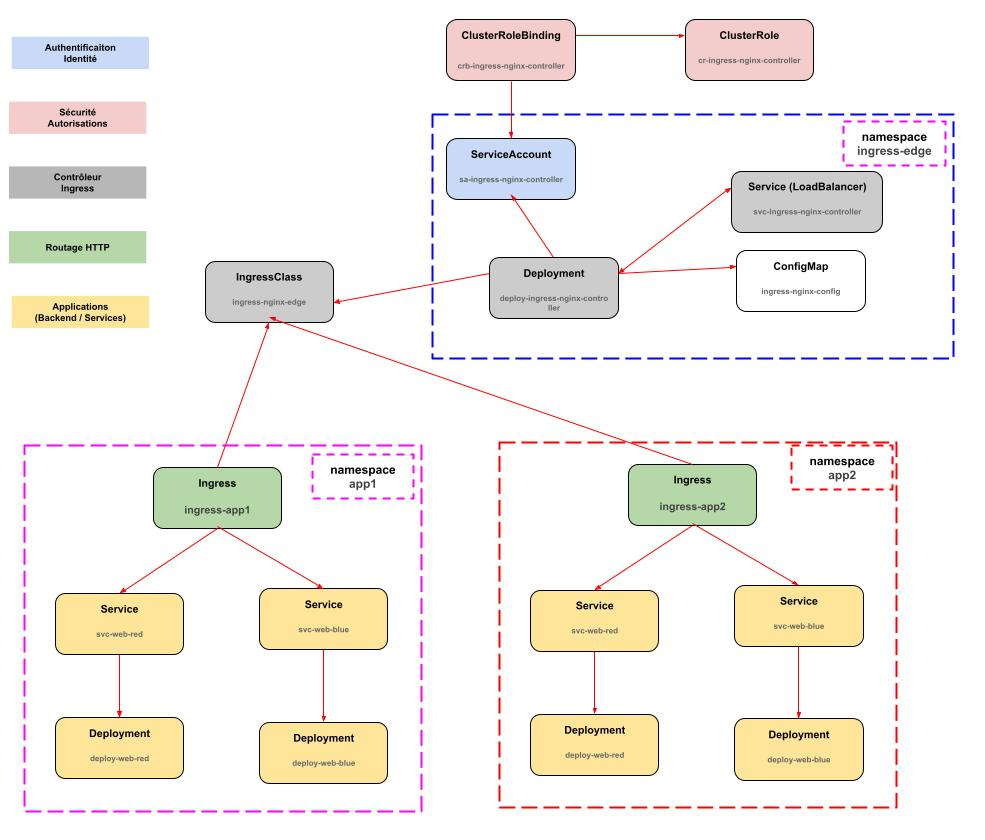
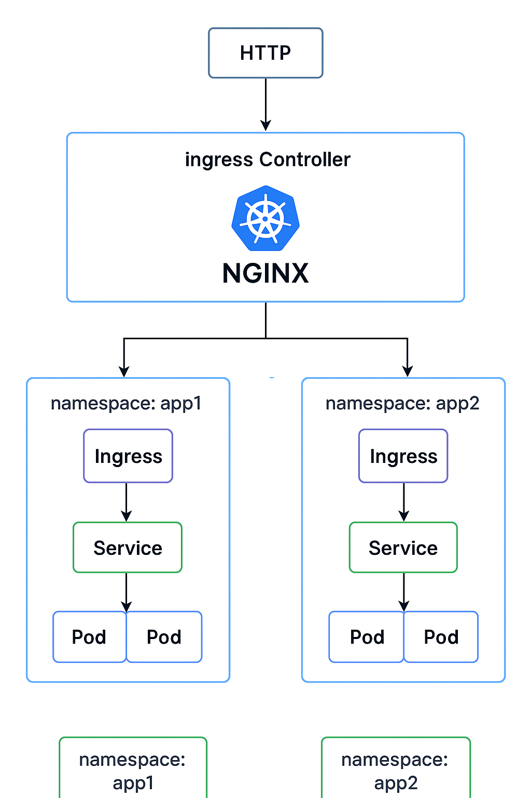

## Déployer & tester sur **minikube**

[deployment.yaml](deployment.yaml)

1. Démarre minikube :
   ```
   minikube start --driver=docker
   ```

2. Obtenir une IP LoadBalancer pour le service edge :
    * Exécute `minikube tunnel` dans un terminal (nécessaire pour services `LoadBalancer`) :

      Laisse ce tunnel up pendant le test.

3. Appliquer le manifeste (fichier `deployment.yaml`) :
   ```
   kubectl apply -f deployment.yaml
   ```

4. Vérifier que le service edge a une IP :
   ```
   kubectl get svc -n ingress-edge
   # regarde l'EXTERNAL-IP sur svc-ingress-nginx-controller
   ```

5. Tester les routes (supposons EXTERNAL-IP = 192.168.49.2) :
   ```
   # app1 red
   curl http://<EXTERNAL-IP>/app1/red
   # app1 blue
   curl http://<EXTERNAL-IP>/app1/blue
   # app2 red
   curl http://<EXTERNAL-IP>/app2/red
   # app2 blue
   curl http://<EXTERNAL-IP>/app2/blue
   ```

***



***

## ⚙️ **Description technique de l’architecture**

Cette architecture met en œuvre un modèle **Edge Gateway unique** basé sur un **Ingress Controller NGINX centralisé** (dans un namespace dédié `ingress-edge`).
C’est ce qu’on appelle une approche *Single Edge Ingress Controller, Multi-tenant Routing*.

### Composants clés

1. **Un seul Ingress Controller NGINX (Edge Layer)**
   * Déployé dans `ingress-edge`.
   * Exposé via un Service `LoadBalancer` (ou NodePort/MetalLB selon l’environnement).
   * Détient l’unique responsabilité de gérer le trafic HTTP(S) entrant dans le cluster.
   * Observe tous les objets `Ingress` ayant la `IngressClass` `ingress-nginx-edge`.

2. **IngressClass unique : `ingress-nginx-edge`**
   * Sert de contrat entre les Ingress applicatifs (`app1`, `app2`, etc.) et le contrôleur.
   * Centralise la gouvernance et simplifie les politiques d’observation.

3. **Namespaces applicatifs (`app1`, `app2`)**
   * Chacun héberge ses microservices (`web-red`, `web-blue`, etc.) et son propre `Ingress`.
   * Les Ingress sont découplés du controller, mais y sont logiquement rattachés via `ingressClassName: ingress-nginx-edge`.
   * Les chemins sont hiérarchisés (`/app1/...`, `/app2/...`), permettant un routage clair et prévisible.

4. **RBAC et ConfigMap globalisés dans le namespace edge**
   * Le controller dispose d’un `ClusterRole` + `ClusterRoleBinding` lui donnant accès en lecture aux Ingress et Services sur tout le cluster.
   * Cela lui permet de router vers des Services situés dans d’autres namespaces, sans devoir dupliquer la logique RBAC.

---

## **Flux réseau (data flow)**

1. Le client (externe ou interne) envoie une requête HTTP vers l’IP du `LoadBalancer` (edge).
   Exemple :
   ```
   http://<LB-IP>/app2/red
   ```
2. Le NGINX Edge reçoit la requête et la mappe sur son `nginx.conf`, généré automatiquement à partir des objets `Ingress` du cluster.
   Il sait que :
   ```
   /app1/* → Services namespace=app1
   /app2/* → Services namespace=app2
   ```
3. NGINX proxy la requête directement vers le Service cible (`svc-web-red` ou `svc-web-blue`), en appliquant les annotations (rewrites, SSL redirect, etc.).
4. La réponse est renvoyée au client, via le même canal, sans rebond inutile ni double proxy.

---

## **Points forts de cette architecture**

### 1. **Simplicité et lisibilité**
* Un seul point d’entrée : plus simple à gérer, monitorer et sécuriser.
* Un seul controller = moins de ressources, moins de configuration dupliquée.
* Compatible avec tout type de cluster (Minikube, EKS, GKE, AKS, etc.).

### 2. **Multi-tenancy clair**
* Chaque équipe/app a son propre namespace, ses propres Ingress et Services.
* Le routage est centralisé mais la configuration applicative reste isolée.
* Permet d’appliquer des NetworkPolicies par namespace sans impacter les autres.

### 3. **Gouvernance et observabilité centralisées**
* Les métriques NGINX, logs et traces sont collectées à un seul endroit (`ingress-edge`).
* Facile d’intégrer un stack observabilité (Prometheus, Grafana, Loki).
* Politique TLS, CORS, rewrites, headers de sécurité — toutes configurables globalement dans un seul ConfigMap.

### 4. **Scalabilité horizontale**
* Le controller NGINX peut être répliqué (`replicas: 2+`) et scale horizontalement.
* Derrière un LoadBalancer, cela offre haute disponibilité et répartition de charge.
* En prod : souvent couplé à un cloud LB (AWS ALB, GCP LoadBalancer, etc.).

### 5. **Isolation des workloads**
* Les namespaces applicatifs sont indépendants.
* Pas de partage de ConfigMap, Secret ou ServiceAccount entre app1 et app2.
* NGINX agit comme un *shared edge gateway*, pas comme un point de couplage fort.

### 6. **Flexibilité future**
* On peut facilement ajouter `app3`, `app4`, etc. :
  il suffit de créer un nouveau namespace et un Ingress avec `ingressClassName: ingress-nginx-edge`.
* Aucun redéploiement du controller requis.
* Compatible avec `cert-manager`, `external-dns`, `oauth2-proxy`, etc.

---

## **Pourquoi ne pas utiliser deux Ingress Controllers ?**

C’est une **question clé d’architecture réseau Kubernetes**.

### ❌ Si tu déploies deux controllers :

* Tu dupliques la logique, la consommation CPU/mémoire, les ConfigMaps et RBAC.
* Tu risques des **conflits d’IngressClass** si les deux controllers observent les mêmes objets.
* Tu ajoutes une couche de complexité réseau (deux LoadBalancers ou NodePorts à gérer).
* Tu casses la cohérence du routage global (un client externe doit savoir à quelle IP se connecter selon l’app).

### De plus :

* En prod, un seul controller peut parfaitement gérer des centaines d’applications (scalabilité horizontale native).
* Kubernetes ne “load-balance” pas entre controllers : chaque Ingress est observé par un seul controller à la fois.
* Deux controllers distincts compliquent la configuration TLS, DNS et monitoring.


