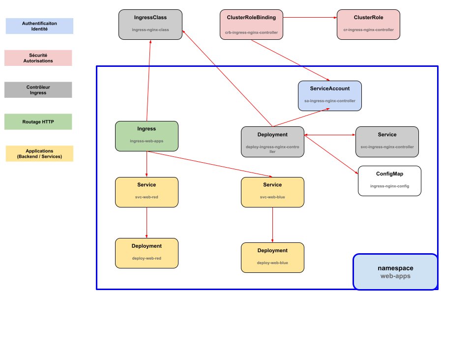

# Exemple complet YAML pour minikube

[deployment.yaml](deployment.yaml)

#### Architecture du flux de fonctionnement

```  
                           🌐  UTILISATEUR / CLIENT HTTP
                                       │
                                       ▼
                  ┌────────────────────────────────────────┐
                  │        NodePort Service (HTTP/HTTPS)   │
                  │  svc-ingress-nginx-controller (port 80/443)  │
                  └────────────────────────────────────────┘
                                       │
                                       ▼
                    🧠 Deployment: deploy-ingress-nginx-controller
                    └── Pod (nginx-controller)
                           │  utilise :
                           │   ↳ ServiceAccount: sa-ingress-nginx-controller
                           │   ↳ ConfigMap: ingress-nginx-config
                           │   ↳ IngressClass: ingress-nginx-class
                           │   ↳ ClusterRoleBinding → ClusterRole → accès API
                           │
                           ▼
                   👂 Observe les objets "Ingress" du cluster
                                       │
                                       ▼
        ┌───────────────────────────────────────────────────────────────────────┐
        │ Ingress: ingress-web-apps                                            │
        │ - ingressClassName: ingress-nginx-class                              │
        │ - Règles :                                                          │
        │     /red(/|$)(.*)  → svc-web-red                                    │
        │     /blue(/|$)(.*) → svc-web-blue                                   │
        └───────────────────────────────────────────────────────────────────────┘
                      │                                  │
                      ▼                                  ▼
         ┌──────────────────────┐            ┌──────────────────────┐
         │ Service: svc-web-red │            │ Service: svc-web-blue│
         │ (ClusterIP, port 80) │            │ (ClusterIP, port 80) │
         └──────────────────────┘            └──────────────────────┘
                      │                                  │
                      ▼                                  ▼
     ┌────────────────────────────┐        ┌────────────────────────────┐
     │ Deployment: web-red        │        │ Deployment: web-blue       │
     │ → Pod nginx-web-red        │        │ → Pod nginx-web-blue       │
     │ → sert "<h1>RED APP</h1>" │        │ → sert "<h1>BLUE APP</h1>" │
     └────────────────────────────┘        └────────────────────────────┘

───────────────────────────────────────────────────────────────────────────────
🧩 Namespace: web-apps
→ Contient tous les objets : Ingress, Services, Deployments, ConfigMap, etc.
───────────────────────────────────────────────────────────────────────────────
🔐 RBAC:
  - ClusterRole: cr-ingress-nginx-controller
  - ClusterRoleBinding: crb-ingress-nginx-controller
    ↳ Lie le ServiceAccount du contrôleur NGINX à ses permissions globales.
───────────────────────────────────────────────────────────────────────────────

```

***

#### Architecture – Diagramme de dépendance des objets Kubernetes



***

## 🚀 Comment utiliser cette architecture


1. Démarrer minikube : `minikube start`
2. Appliquer le YAML complet : `kubectl apply -f deployment.yaml`
3. Tester dans le navigateur :
``` 
$ minikube service svc-ingress-nginx-controller -n web-apps --url 
http://192.168.49.2:31811 # c'est le HTTP
http://192.168.49.2:32021 # c'est le HTTPS

$ curl http://192.168.49.2:31811/red
<h1>RED APP</h1>

$ curl -k http://192.168.49.2:32021/blue
<h1>BLUE APP</h1>
 
```

***

## 🌐 Vue d’ensemble

Cette architecture met en place un **mini écosystème web** dans Kubernetes, avec :

* un **contrôleur Ingress NGINX** (le “cerveau du trafic HTTP”) ;
* deux **applications web (RED et BLUE)** déployées indépendamment ;
* un **Ingress** qui gère le routage entre elles ;
* une **gestion fine des permissions (RBAC)** pour sécuriser le contrôleur.

Le tout est isolé dans un **namespace** spécifique pour bien séparer ce projet des autres.

---

### 🧩 1. Namespace : `web-apps`

#### 🎯 Objectif

Le **Namespace** sert à regrouper logiquement toutes les ressources liées à une même application ou projet.

#### 🧠 Fonctionnement

* Kubernetes organise ses objets dans des *namespaces* (un peu comme des “dossiers logiques”).
* Tout ce que tu crées ici (Pods, Services, Ingress, ConfigMap, etc.) est limité à cet espace.
* Cela évite les collisions de noms et simplifie la gestion (quotas, droits, monitoring...).

📦 Ici, tout vit dans `web-apps`.

---

### ⚙️ 2. ConfigMap : `ingress-nginx-config`

#### 🎯 Objectif

Permet au **contrôleur NGINX** de charger une configuration dynamique (timeouts, logs, taille de requêtes, headers, etc.).

#### 🧠 Fonctionnement

* Le contrôleur NGINX lit ce ConfigMap en temps réel.
* Si tu modifies un paramètre (ex: `proxy-body-size`), NGINX l’applique sans redéploiement.

📘 Dans ton cas, il est vide → NGINX tourne avec ses valeurs par défaut.

---

### 🧭 3. IngressClass : `ingress-nginx-class`

#### 1️⃣ Rappel : à quoi sert une IngressClass ?

Une **IngressClass** est un objet Kubernetes qui permet de dire **quel contrôleur Ingress doit gérer les Ingress dans le cluster**.

* Imagine un cluster avec **plusieurs contrôleurs Ingress** (NGINX, Traefik, HAProxy…)
* Chaque Ingress peut spécifier sa classe (`ingressClassName`) pour savoir **quel contrôleur va s’occuper d’elle**.

Sans IngressClass, Kubernetes va utiliser le **contrôleur par défaut** (s’il y en a un), mais ça devient dangereux si tu as plusieurs contrôleurs.

---

#### 2️⃣ Structure de l’IngressClass

```yaml
apiVersion: networking.k8s.io/v1
kind: IngressClass
metadata:
  name: ingress-nginx-class
spec:
  controller: k8s.io/ingress-nginx
```

#### 🔹 `metadata.name`

* Le **nom unique** de cette classe.
* Exemple : `ingress-nginx-class`
* C’est ce nom que tu vas mettre dans tes objets Ingress :

```yaml
# dans "Ingress"  ingress-web-apps

spec:
  ingressClassName: ingress-nginx-class
```

---

#### 🔹 `spec.controller`

* C’est le **contrôleur qui va gérer les Ingress de cette classe**.
* Ici : `k8s.io/ingress-nginx`

    * Cela correspond au **contrôleur NGINX officiel**.
    * Kubernetes sait que quand un Ingress a `ingressClassName: ingress-nginx-class`, c’est ce contrôleur qui doit le prendre en charge.

> ⚠️ Important : cette valeur est **standardisée par chaque contrôleur**.
> Tu ne choisis pas n’importe quoi. Pour NGINX, c’est toujours `k8s.io/ingress-nginx`.

---

#### 3️⃣ Comment ça fonctionne dans ton architecture

1. Tu crées l’IngressClass `ingress-nginx-class`.
2. Le déploiement NGINX IngressController est configuré pour gérer cette classe :

```yaml
- --ingress-class=ingress-nginx-class
- --controller-class=k8s.io/ingress-nginx
```

3. Tes objets Ingress utilisent cette classe :

```yaml
spec:
  ingressClassName: ingress-nginx-class
```

✅ Résultat : **seul ce contrôleur va gérer ces Ingress**, même si d’autres contrôleurs sont présents.\
L'utilisation du champ ingressClassName dans les ressources Ingress permet de cibler explicitement un contrôleur Ingress particulier et empêche les autres contrôleurs de gérer ces Ingress s'ils ne sont pas associés à cette classe. 

---

#### 4️⃣ Pourquoi c’est utile

* Sécurité : pas de chevauchement entre plusieurs IngressControllers.
* Clarté : tu sais quel contrôleur gère quel Ingress.
* Extensibilité : tu peux déployer plusieurs contrôleurs pour différents types de trafic (HTTP, HTTPS, interne, externe…) sans conflit.

---

💡 **En résumé :**

* `metadata.name` → le nom de la classe que tu réutilises dans tes Ingress.
* `spec.controller` → le contrôleur qui va gérer ces Ingress.

C’est juste **une “étiquette” pour dire : ce Ingress doit être pris en charge par tel contrôleur**.

---

### 👤 4. ServiceAccount : `sa-ingress-nginx-controller` **identité du contrôleur**

```yaml
apiVersion: v1
kind: ServiceAccount
metadata:
  name: sa-ingress-nginx-controller
  namespace: web-apps
```

#### **1️⃣ Qu’est-ce que c’est ?**

Un **ServiceAccount** (compte de service) est une identité pour un ou plusieurs pods dans Kubernetes.
Il permet à un pod de **s’authentifier auprès de l’API Kubernetes** et d’obtenir des permissions (via des rôles comme ClusterRole).

#### **2️⃣ Les champs importants**

* **metadata.name** : le nom du ServiceAccount. Ici `sa-ingress-nginx-controller`.
  C’est ce nom que l’on référence dans le pod du contrôleur NGINX via `serviceAccountName`.
* **metadata.namespace** : le namespace où il est créé. Les permissions et les pods sont limitées à ce namespace si on ne met pas de ClusterRoleBinding.

#### **3️⃣ Rôle dans cette architecture**

* Le pod **Ingress NGINX** utilise ce ServiceAccount pour **parler à l’API Kubernetes**.
* Grâce à lui, le contrôleur peut **lire les Services, Pods, Endpoints, ConfigMaps, Ingress** et **mettre à jour l’état des Ingress**.
* Sans ce ServiceAccount, le pod n’aurait pas d’identité et ne pourrait pas obtenir les droits nécessaires (même si le ClusterRole existe, il doit être lié via un ServiceAccount).

#### **4️⃣ Pourquoi c’est important ?**

* Permet de **séparer les permissions** : le contrôleur NGINX a exactement les droits dont il a besoin, pas plus.
* Renforce la **sécurité** : si un pod est compromis, il n’a accès qu’à ce que son ServiceAccount autorise.
* Nécessaire pour le bon fonctionnement du contrôleur, surtout dans un cluster multi-tenant.

#### **5️⃣ Comment ça se connecte aux autres objets**

* Le pod NGINX fait référence à ce ServiceAccount dans son **Deployment** :

```yaml
# dans "Deployment" deploy-ingress-nginx-controller

spec:
  serviceAccountName: sa-ingress-nginx-controller
```

* Ensuite, un **ClusterRoleBinding** relie ce ServiceAccount à un **ClusterRole** pour lui donner les permissions globales sur le cluster.

---

### 🔐 5. ClusterRole & 6. ClusterRoleBinding

#### 🎯 Objectif

Donner les **permissions nécessaires** au contrôleur NGINX via le RBAC (Role-Based Access Control).

**ClusterRole**
> → C’est la **liste d’autorisations** (“ce que j’ai le droit de faire”).
> Exemple : *je peux lire les services, les pods, les ingress, etc.*

**ServiceAccount**
> → C’est **l’identité** utilisée par un Pod (dans ton cas : le contrôleur Ingress).
> Exemple : *je suis `sa-ingress-nginx-controller`, dans le namespace `web-apps`.*

**ClusterRoleBinding**
> → C’est la **liaison** entre l’identité et les permissions.
> Exemple : *le compte `sa-ingress-nginx-controller` a les droits du rôle `cr-ingress-nginx-controller`.*

#### 🧠 Fonctionnement

* Le **ClusterRole** définit une liste d’autorisations (lire les services, pods, ingress...).
* Le **ClusterRoleBinding** relie ce rôle au **ServiceAccount** du contrôleur.

Ainsi, le pod du contrôleur peut :

* Lire les objets du cluster (`get`, `list`, `watch`)
* Gérer les statuts des `Ingress`
* Écrire des `events`
* Faire l’élection d’un leader (utile si tu avais plusieurs réplicas)

⚙️ Cette partie RBAC est **essentielle** pour le bon fonctionnement d’un Ingress Controller.

---

### 🚀 7. Deployment : `deploy-ingress-nginx-controller`

#### 🎯 Objectif

C’est le **composant central** — le cœur de ton routage HTTP.

#### 🧠 Fonctionnement

* Ce déploiement crée un **pod NGINX Controller**.
* Il :

    1. Observe les objets `Ingress` dans le cluster ;
    2. Configure dynamiquement un reverse proxy NGINX interne ;
    3. Écoute sur les ports 80/443 pour accepter les connexions ;
    4. Route le trafic vers les bons services.

#### 🔗 Liaisons

* Utilise le `ServiceAccount` pour interagir avec l’API.
* Lit la `ConfigMap` pour ajuster sa config.
* Exposé via le `Service` suivant (`svc-ingress-nginx-controller`).
* Se reconnaît via les labels `app: ingress-nginx-controller`.

---

### 🌐 8. Service : `svc-ingress-nginx-controller`

#### 🎯 Objectif

Exposer le **pod du contrôleur NGINX** à l’extérieur du cluster.

#### 🧠 Fonctionnement

* Type `NodePort` → chaque nœud du cluster ouvre un port statique (ex : 30080).
* Le trafic externe (depuis ton navigateur) arrive sur ce port et est transmis au pod du contrôleur.

#### 🧩 Rôle clé

C’est **le point d’entrée du cluster** :

```
Navigateur → NodePort → Contrôleur NGINX → Ingress → Services → Pods
```

---

### 🔴 9. Deployment : `deploy-web-red`

#### 🎯 Objectif

Déployer l’application “RED” (simple serveur NGINX).

#### 🧠 Fonctionnement

* Le pod lance un NGINX et remplace la page d’accueil par `<h1>RED APP</h1>`.
* Il écoute sur le port 80.
* Il sera relié à un `Service` qui le rend accessible dans le cluster.

---

### 🔵 10. Deployment : `deploy-web-blue`

#### 🎯 Objectif

Même logique que RED, mais pour “BLUE”.

#### 🧠 Fonctionnement

* Conteneur identique (NGINX) ;
* Affiche `<h1>BLUE APP</h1>`;
* Exposé via un service distinct (`svc-web-blue`).

---

### 🧩 11–12. Services : `svc-web-red` & `svc-web-blue`

#### 🎯 Objectif

Expose chaque application à l’intérieur du cluster (type `ClusterIP`).

#### 🧠 Fonctionnement

* Le **Service** agit comme un **load balancer interne**.
* Il découvre les pods via les labels (`app: web-red` ou `app: web-blue`).
* Il reçoit le trafic du contrôleur NGINX et l’envoie au bon pod.

🔗 Ces services sont **les backends** du routage Ingress.

---

### 🚦 13. Ingress : `ingress-web-apps`

#### 🎯 Objectif

Le chef d’orchestre du **routage HTTP** entre les URL et les services.

#### 🧠 Fonctionnement

* L’Ingress est une ressource Kubernetes déclarative.
* Il décrit les **règles de routage** pour le contrôleur Ingress.
* Le contrôleur NGINX lit cet objet et met à jour automatiquement sa configuration interne.

#### 📜 Dans ton cas :

| URL demandée           | Cible backend    | Service appelé |
| ---------------------- | ---------------- | -------------- |
| `/red` ou `/red/...`   | Application RED  | `svc-web-red`  |
| `/blue` ou `/blue/...` | Application BLUE | `svc-web-blue` |

#### ⚙️ Annotation :

`nginx.ingress.kubernetes.io/rewrite-target: /$2`
→ Permet de **réécrire l’URL** pour que le backend reçoive un chemin propre (`/` au lieu de `/red/...`).

